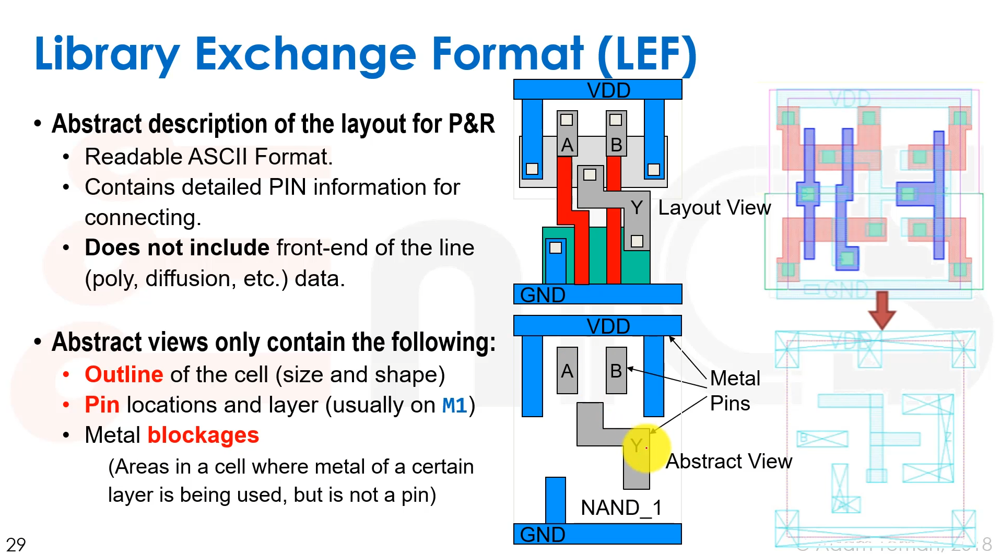

# Notes about synthesis

## Basic synthesis flow

* Syntax Analysis:

    * Read in HDL files and check for syntax errors.
    
        read_hdl -verilog sourceCode/toplevel.v
    
* Library Definition

    * Provide standard cells and IP Libraries.
        ```
        read_libs "/.../....lib/.lib"
        ```

* Elaboration and Binding:

    * Convert RTL into Boolean structure.
    
    * State reduction, encoding, register infering.

    * Bind all leaf cells to provided libraries.
        ```
        elaborate toplevel
        ```

* Constraint Definition

    * Define clock frequency and other constraints.
        ```
        read_sdc sdc/constraints.sdc
        ```

* Pre-mapping Optimization:

    * Map to generic cells and perform additional heuristics
        ```
        syn_generic
        ```
* Technology Mapping:
  
    * Map generic logic to technology libraries
        ```
        syn_map
        ```
* Post-mapping Optimization:

    * Iterate over design, changing gate sizes, Boolean literals, architectural approaches to try and meet constraints.
        ```
        syn_opt
        ```
* Report and export

## What is a library?

* A standard cell library is a collection of well defined and appropriately characterized logic gates that can be used to implement a digital design.

## What cells are in a standard cell library?

* Combinational logic cells(NAND, NOR, INV, etc.):

    * Variety of drive strengths for all cells.

    * Complex cells(AOI, OAI. etc)

        AOI: AND-OR-INVERT

    * Fan-In <= 4

    * ECO Cells

* Buffers/Inverters
  
    * Larger variet of drive strengths.
    
    * "Clock cells" with balanced rise and fall delays.

    * Delay cells

    * Level Shifters

* Sequential Cells:

    * Many types of flip flops: pos/negedge, set/reset, Q/QB, enable 

    * Lathches

    * Integrated Clock Gating cells

    * Scan enabled cells for ATPG

* Physical Cells:

    * Fillers, Tap cells, Antennas, DeCaps, EndCaps, Tie Cells

## What files are in a standard cell library?


## Library Exchange Format(LEF)



## Technology LEF


    


## Technology LEF


## Liberty(.lib): Introduction

* How do we know the delay through a gate in a logic path?

    * Running SPICE is way too complex.

    * Instead, create a timing model that will simplify the calculation.

* Goal:

    * For every timing arc, calculate:

        * Propagation Delay(t<sub>pd</sub> )

        * Output transition(t<sub>rise</sub> , t<sub>fall</sub>)

    * Based on:

        * Input net transition(t<sub>rise</sub> , t<sub>fall</sub>)

        * Output Load Capacitance(C<sub>load</sub>)

Note that evevry .lib will provide timing/power/noise information for a single corner, i.e., **process, voltage, temperature, RCX**, etc.

## Elaboration and binding


## Constraint Definition

* Following **Elaboration**, the design is loaded into the synthesis tool and stored inside a data structure.

* Hierarchical ports(inputs/outputs) and registers can be accessed by name.

    ```
    set in_ports [get_ports IN*]
    
    set regs [get_cells -hier *_reg]
    ```
    
* At this point, we can load the design constraints in **SDC** format.

    ```
    read_sdc -verbose sdc/constraints.sdc
    ```
    * For example, to create a clock and define the target frequency:
    
    ```
    create_clock -period $PERIOD -name $CLK_NAME [get_ports $CLK_PORT]
    ```

