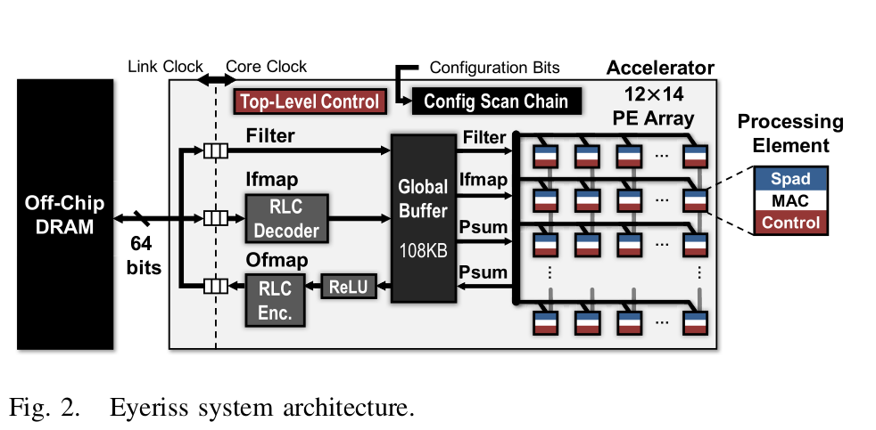

# Papers

## Dissecting Convolutional Neural Networks for Efficient Implementation on Constrained Platforms

### LeNet

The LeNet architecture is comprised of a convolutional layer
with six 5 × 5 filters and a max-pooling layer with stride 2, followed by another convolutional layer with sixteen 5 × 5 Filters and a max-pooling layer with stride 2. Three fully connected layers follow, with sigmoid activation for the first two and softmax for the last.

## An Enhanced Data Cache with In-Cache Processing Units for Convolutional Neural Network Accelerators

### In-cache processing unit

## A High Energy Efficient Reconfigurable Hybrid Neural Network Processor for Deep Learning Applications

### Different Data Access Patterns and Data Reusability in ConvNet and FCNet/RNN

### Finite-State Controller

### Computation flow

## Eyeriss: An Energy-Efficient Reconfigurable Accelerator for Deep Convolutional Neural Networks

### System architecture

Fig. 2 shows the top-level architecture and memory hierarchy of the Eyeriss system. Eyeriss has two clock domains: the core clock domain for processing, and the link clock domain for communication with the off-chip DRAM through a 64-b bidirectional data bus. The two domains run independently and communicate through an asynchronous FIFO interface.

### Exploit Data Statistics

### Results

### Useful Sentences

* The ... dominate the power consumption.

## MorphoSys: An Integrated Reconfigurable System for Data-Parallel and Computation-Intensive Applications

### Useful Sentences

* The system allows customization of...
* The significance of ... can be illustrated through ...
* meeting the constraints of ...
* be comprised of ...
* the intent of ... is to ...
* Section 2 provides brief explanations of ...
* Section 3 introduces/describes/illustrates
* Fig. 2 depicts ...

## NP-CGRA: Extending CGRAs for Efficient Processing of Light-weight Deep Neural Networks

### APPLICATION MAPPING FOR NP-CGRA: DWC CASE

## PuDianNao: A Polyvalent Machine Learning Accelerator

### Control and Code Generator
Some hints about distance calculation

### Useful Sentences

* In order to address needs under different scenarios
* The ... is designed to support several basic yet important computational primitives which are common in ...

## ShiDianNao: Shifting Vision Processing Closer to the Sensor

### Useful Sentences

* Therefore, we adopt an efficient alternative:
