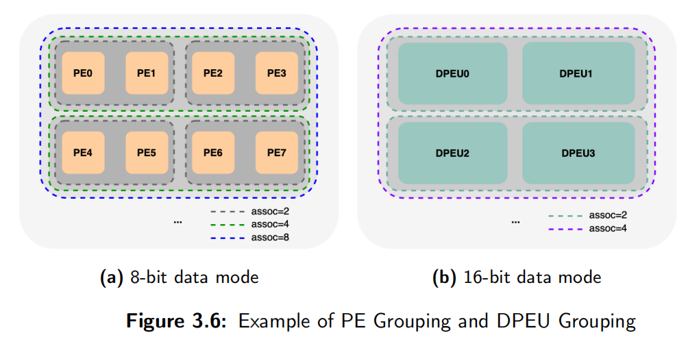

# 求职笔记

## System Verilog

### [SV 116道题目和答案](https://blog.csdn.net/qq_55894557/article/details/126404925)

* **通常状况下，使用systemverilog相对较多的，在专用集成芯片设计流程中关注设计的验证行为，进行的验证工作主要指：**

  >A  RTL功能验证
  >
  >B 门级的仿真
  >
  >C 形式验证
  >
  >D 时序验证
  >
  >答案：A
  >
  >笔记：
  >
  >寄存器传输级 （ RTL） 的功能验证。
  >
  >门级的仿真， 为了验证综合后网表和期望的功能是否一致。
  >
  >形式验证 （ 等价性检查） 来确保门级网表和RTL 代码的一致性。
  >
  >时序验证， 为了验证设计能否在特定的频率上运行， 通常采用静态验证工具。
  >
  >功能验证在专用集成芯片设计流程中关注设计的行为， 几乎所有的功能都可以在RTL层次被验证。

* **相比四状态数据类型，System Verilog引入的双状态数据类型有利于提高仿真器的性能并减少内存的使用量。下面选项中，关于System Verilog双状态数据类型说法错误的是（）？**

  >A bit数据类型是双状态，单比特，无符号的
  >
  >B int数据类型是双状态，32比特有符号整数
  >
  >C longint数据类型是双状态，32位有符号整数
  >
  >D real数据类型是双状态，双精度浮点数
  >
  >答案：C
  >
  >笔记：
  >
  >System Verilog中带符号的数据类型：
  >
  >bit b;                    //双状态，单比特
  >
  >bit [31:0] b32;      //双状态，32比特无符号整数
  >
  >int unsigned ui;    //双状态，32比特无符号整数
  >
  >int i;                     //双状态，32比特有符号整数
  >
  >byte b8;               //双状态，8比特有符号整数
  >
  >shortint s;            //双状态，16比特有符号整数
  >
  >longint l;              //双状态，64比特有符号整数
  >
  >integer i4;           //四状态，32比特有符号整数
  >
  >time t;                 //四状态，64比特无符号整数
  >
  >real r;                 //双状态， 双精度浮点数

# 基础知识

* **组合逻辑**电路是任意时刻的输出仅仅取决于该时刻的输入，与电路原来的状态无关。 **时序逻辑**电路是不仅仅取决于当前的输入信号，而且还取决于电路原来的状态，或者说，还与以前的输入有关。 **组合逻辑**电路没有存储记忆，**时序逻辑**电路却包含了存储记忆。
* **Moore Machine VS. Mealy Machine**:
   * A Moore machine produces glitch-free outputs.
   * A Moore machine produces outputs depending only on states, and this may allow using a higher-frequency clock.
   * A Mealy machine can be specified using fewer gates.
     * Because it is capable of producing different outputs in a given state.
   * A Mealy machine can be faster. 
     * Because an output may be produced immediately instead of at the next clock tick.

* **时间抖动jitter**/**偏移skew**

  **jitter**:由于晶振本身稳定性，电源以及温度变化等原因造成了时钟频率的变化，就是jitter, 指的是是时钟周期的变化，也就是说**时钟周期在不同的周期上可能加长或缩短**。这个误差是在时钟发生器内部产生的，和晶振或者PLL内部电路有关。

  **skew**:是指同样的时钟产生的多个子时钟信号之间的延时差异。**skew通常是时钟相位上的不确定**。由于时钟源到达不同寄存器所经历路径和负载的不同，时钟边沿的位置有所差异，因此就带来了skew。

  

* **毛刺glitch**

  由于信号在FPGA的内部走线和通过逻辑单元时造成的延迟，在多路信号变化的瞬间，组合逻辑的输出常常产生一些小的尖峰，即毛刺信号。

  * **利用冗余项**

    利用冗余项消除毛刺有2中方法：代数法和卡诺图法，两者都是通过增加冗余项来消除险象，只是前者针对函数表达式而后者针对于真值表。以卡诺图为例，若两个卡诺圆相切，其对应的电路就可能产生险象。因此，修改卡诺图，在卡诺图的两圆相切处增加一个圆，以增加多余项来消除逻辑冒险。

  * **采样法**

    由于冒险多出现在信号发生电平跳变的时刻，即在输出信号的建立时间内会产生毛刺，而在保持时间内不会出现，因此，在输出信号的保持时间内对其进行采样，就可以消除毛刺信号的影响，常用的采样方法有2种:一种使用一定宽度的高电平脉冲与输出相与，从而避开了毛刺信号，取得输出信号的电平值。这种方法必须保证采样信号在合适的时间产生，并且只适用于对输出信号时序和脉冲宽度要求不严的情况。另一种更常见的方法叫锁存法，是利用D触发器的输入端D对毛刺信号不敏感的特点，在输出信号的保持时间内，用触发器读取组合逻辑的输出信号。由于在时钟的上升沿时刻，输出端Q=D，当输入的信号有毛刺时，只要不发生在时钟的上升沿时刻，输出就不会有毛刺。这种方法类似于将异步电路转化为同步电路，实现简单，但同样会涉及到时序问题

  * **吸收法**

    由于产生的毛刺实际上是高频窄脉冲，故增加输出滤波，在输出端接上小电容C就可以滤除毛刺。但输出波形的前后沿将变坏，在对波形要求较严格时，应再加整形电路，该方法不宜在中间级使用。

  * **硬件描述语言**

    这种方法是从硬件描述语言入手，找出毛刺产生的根本原因，改变语言设计，产生满足要求的功能模块，来代替原来的逻辑功能块。一个3位计数器可能会在011到100和101到110发生跳变时产生毛刺，究其原因是因为一次有2位发生跳变，可以采用VHDL语言对计数器编写如下，产生的计数模块代替原来普通的计数器。
  
* **锁存器/触发器**

  latch是电平触发，register是边沿触发，register在同一时钟边沿触发下动作，符合同步电路的设计思想，而latch则属于异步电路设计，往往会导致时序分析困难，不适当的应用latch则会大量浪费芯片资源。
  一般将信号经过两级触发器就可以消除毛刺。

* **竞争/冒险**

  **竞争与冒险是逻辑门因输入端的竞争而导致输出产生不应有的尖峰干扰脉冲（又称过渡干扰脉冲）的现象**。在门电路中，两个输入信号同时向两个相反方向的逻辑状态转换，即一个从低电平变为高电平，一个从高电平变为低电平，或反之，称为竞争。由于竞争而在电路的输出端可能产生尖峰脉冲的现象称为冒险。竞争不一定会产生冒险，但冒险就一定有竞争。

  消除竞争冒险的方法常见有4种：
  1）修改逻辑设计，这主要包括去除互补逻辑变量和增加冗余项。
  2）输出端并联电容，这主要利用了电容的充放电特性，对毛刺滤波，对窄脉冲起到平波的作用。
  3）利用格雷码每次只有一位跳变，消除了竞争冒险产生的条件。
  4）利用D触发器对毛刺不敏感的特性。

* **建立时间/保持时间**

  **建立时间：触发器在时钟上升沿到来之前，其数据输入端的数据必须保持不变的时间。**
  
  建立时间决定了该触发器之间的组合逻辑的最大延迟。
  
  **保持时间：触发器在时钟上升沿到来之后，其数据输入端的数据必须保持不变的时间。**
  
  保持时间决定了该触发器之间的组合逻辑的最小延迟。
  
  对于建立时间违例的解决办法：
  1. 降低时钟频率，即增大时钟周期
  
  2. 再时钟路径上加缓冲器（buffer），让时钟晚到来。
  
  3. 更换具有更小器件延迟的触发器。
  
  4. 组合逻辑优化或插入流水线，缩短关键路径。
  
  对于保持时间违例的解决办法：
  
  5. 在数据路径上插buffer
  
  6. 更换具有更大器件延迟的触发器
  
  7. 优化时钟路径，让时钟更早到来。

* **同步时钟**

  当两个时钟间的相位是固定关系的，则可以称这两个时钟为同步时钟(synchronous clock)。
  注意，这个表述很重要。
  那么这里就又有一种情况，经过一个PLL产生相位不同，但相位固定的两个时钟，他们依旧是同步时钟。

  

  而如果是两个晶振产生的时钟，因为两个晶振在上电时相位差是随机的，而且不同晶振时钟漂移抖动也不一样，所以相位是不固定的。
  当无法判断两个时钟间的相位时，则可以称这两个时钟为异步时钟(asynchronous clocks)。

* **同步电路/异步电路**

  异步电路：
  a) 电路核心逻辑有用组合电路实现;
  b) 异步时序电路的最大缺点是容易产生毛刺;
  c) 不利于器件移植;
  d) 不利于静态时序分析(STA)、验证设计时序性能。
  
  
  
  同步电路：
  a) 电路核心逻辑是用各种触发器实现;
  b) 电路主要信号、输出信号等都是在某个时钟沿驱动触发器产生的;
  c) 同步时序电路可以很好的避免毛刺;
  d) 利于器件移植;
  e) 利于静态时序分析(STA)、验证设计时序性能。

* **同步FIFO/异步FIFO**

  同步FIFO的写时钟和读时钟为同一个时钟，FIFO内部所有逻辑都是同步逻辑，常常用于交互数据缓冲。异步FIFO的写时钟和读时钟为异步时钟，FIFO内部的写逻辑和读逻辑的交互需要异步处理，异步FIFO常用于跨时钟域交互。

* **Verilog跨时钟域传输快到慢**

​        https://www.runoob.com/w3cnote/verilog2-fast2slow.html

* **同步FIFO和异步FIFO**
[https://blog.csdn.net/qq_40230112/article/details/109766740#:~:text=%E5%90%8C%E6%AD%A5FIFO%E6%98%AF%E6%8C%87%E8%AF%BB,%E6%97%B6%E9%92%9F%E6%98%AF%E4%BA%92%E7%9B%B8%E7%8B%AC%E7%AB%8B%E7%9A%84%E3%80%82](https://blog.csdn.net/qq_40230112/article/details/109766740#:~:text=同步FIFO是指读,时钟是互相独立的。)
https://blog.csdn.net/CLL_caicai/article/details/104533249

* **跨时钟域处理**

  单bit信号

  1. 电平检测：
     最为简单的方法。通过寄存器打两拍进行同步，也就是所谓的电平同步器。
     存在问题为，输入信号必须保持两个接收时钟周期，每次同步完，输入信号要恢复到无效状态。所以，如果是从快到慢，信号很有可能被滤除。
     **适用于慢时钟域向快时钟域。**
  2. 边沿检测：
     在电平同步器的基础上，通过输出端的逻辑组合，可以完成对于信号边沿的提取，识别上升沿，下降沿以及双边沿，并发出相应的脉冲。
     比起电平同步器，更适合要求脉冲输出的电路。
     但同样，输入信号必须保持两个接收时钟周期。
     **适用于慢时钟域向快时钟域。**

  3. 脉冲同步：
      先将原时钟域下的脉冲信号，转化为电平信号（使用异或门），再进行同步，同步完成之后再把新时钟域下的电平信号转化为脉冲信号（边沿检测器的功能）。
      这就从快时钟域的取出一个单时钟宽度脉冲，在慢时钟域建立新的单时钟宽度脉冲。
      结合了之前所提到的两种同步器。
      但存在一个问题，输入脉冲的时间间距必须在两个接收时钟周期以上，否则新的脉冲会变宽，这就不再是单时钟脉冲了。
      **适用于快时钟域向慢时钟域。**

    
  
  对于多bit的异步信号，可以采用如下方法：
    1. 可以采用保持寄存器加握手信号的方法（多数据，控制，地址）；
    2. 特殊的具体应用电路结构,根据应用的不同而不同；
    3. 异步FIFO。（最常用的缓存单元是DPRAM）

* **有限状态机FSM设计**

  状态机描述时关键是要描述清楚几个状态机的要素，即如何进行状态转移，每个状态的输出是什么，状态转移的条件等。具体描述时方法各种各样，最常见的有三种描述方式：
  （1）一段式：整个状态机写到一个always模块里面，在该模块中既描述状态转移，又描述状态的输入和输出；
  （2）二段式：用两个always模块来描述状态机，其中一个always模块采用同步时序描述状态转移；另一个模块采用组合逻辑判断状态转移条件，描述状态转移规律以及输出；
  （3）三段式：在两个always模块描述方法基础上，使用三个always模块，一个always模块采用同步时序描述状态转移，一个always采用组合逻辑判断状态转移条件，描述状态转移规律，另一个always模块描述状态输出(可以用组合电路输出，也可以时序电路输出)。

* **关键路径**

  **关键路径通常是指同步逻辑电路中，组合逻辑时延最大的路径（这里我认为还需要加上布线的延迟），也就是说关键路径是对设计性能起决定性影响的时序路径。**

  对关键路径进行时序优化，可以直接提高设计性能。对同步逻辑来说，常用的时序优化方法包括Pipeline、Retiming、逻辑复制、加法/乘法树、关键信号后移、消除优先级等解决。
  静态时序分析能够找出逻辑电路的关键路径。通过查看静态时序分析报告，可以确定关键路径。

  1. **组合逻辑中插入寄存器（插入流水线）**
  组合逻辑的延时过长，就会成为关键路径，这时可以考虑在该路径上插入额外的寄存器，这种方法也称为插入流水线，多用于高度流水的设计中，因为这种设计中额外插入寄存器增加的时钟周期延时并不会违反整个设计的规范要求，从而不会影响设计的总体功能性实现，也即额外插入的寄存器在保持吞吐量不变的情况下改善了设计的时序性能。当然，其不可避免地会带来部分面积的增加。

  2. **寄存器平衡（重定时Retiming）**
     在不增加寄存器个数的前提下，通过改变寄存器的位置来优化关键路径，可以对比和流水线插入寄存器的不同。

  3. **操作符平衡（加法树、乘法树）**
     平衡前，a和b均经过3个乘法器带来的延时，c经历2个，d经历1个，最长延时为3个乘法器延时。平衡后，树形结构，a、b、c、d均经历2个乘法器延时，最长延时为2个乘法器延时。

  4. **消除代码优先级（case代替if…else）**
  本身确实不需要优先级的地方，可以使用case代替if…else，使得顺序执行的语句编程并行执行。如果确实有优先级兵，则不能这样做。这种消除代码中的优先级的策略也称为代码结构平坦化技术，主要针对那些带优先级的编码结构。

  5. **逻辑复制**
     当某个信号的扇出fanout比较大时，会造成该信号到各个目的逻辑节点的路径变得过长，从而成为设计中的关键路径，此时可以通过对该信号进行复制来降低扇出。高扇出的危害是大大增加了布局布线的难度，这样其扇出的节点也就无法被布局得彼此靠近，所以就导致了布线长度过大的问题。

  6. **关键信号后移**
     关键输入应该在逻辑最后一级提供，其中关键输入为芯片、Slice、或者LUT提供的时延最大的输入，比如在if…else if…链中，将关键信号放在第一级。

* **PLL**
  PLL的英文全称是Phase Locked Loop，即锁相环，是一种反馈控制电路。
  锁相环作为一种反馈控制电路，其特点是利用外部输入的参考信号控制环路内部震荡信号的频率和相位。因为锁相环可以实现输出信号频率对输入信号频率的自动跟踪，所以锁相环通常用于闭环跟踪电路。锁相环在工作的过程中，当输出信号的频率与输入信号的频率相等时，输出电压与输入电压保持固定的相位差值，即输出电压与输入电压的相位被锁住，这就是锁相环名称的由来。
  
* **静态/动态时序分析**

  **静态时序分析（static timing analysis，STA）**是遍历电路存在的所有时序路径，根据给定工作条件（
  PVT）下的时序库.lib文件计算信号在这些路径上的传播延时，检查信号的建立和保持时间是否满足约束要求，根据最大路径延时和最小路径延时找出违背时序约束的错误。

    静态时序分析的优点：
    1. 不需要给输入激励；
  
    2. 几乎能找到所有的关键路径（critical path）；
  
    3. 运行速度快；
  
    静态时序分析的缺点：
  
    4. 只适用同步电路；
  
    5. 无法验证电路的功能；
  
    6. 需要比较贵的工具支持；
  
    7. 对于新工艺可能还需要建立一套特征库，建库的代价可能要几百万。
  
  动态时序分析（dynamic timing analysis，DTA）通常是所有的输入信号都会给一个不同时刻  的激励，在  testbech（.sp或者.v）中设置一段仿真时间，最后对仿真结果进行时序和功能分析。 这里的仿真可以是门级  或者晶体管级，包括spice格式和RTL格式的网表。
  
    动态时序分析的优点：
  
    1) 晶体管级的仿真比较精确，直接基于工厂提供的spice 工艺库计算得到；
    2) 适用于任何电路，包括同步、异步、latch等等；
    3) 不需要额外搞一套特征库；
    4) 不需要很贵的时序分析工具。
  
    缺点：
    1) 需要给不同的测试激励；
    2) 关键路径无法检查全 （致命性的）；
    3) 规模大的电路spice仿真特别慢 （致命性的）。

* **DMA**

  DMA(Direct Memory Access，直接存储器访问) 是所有现代电脑的重要特色，它允许不同速度的硬件装置来沟通，而不需要依赖于 CPU 的大量中断负载。否则，CPU 需要从来源把每一片段的资料复制到暂存器，然后把它们再次写回到新的地方。在这个时间中，CPU 对于其他的工作来说就无法使用。
  DMA 传输将数据从一个地址空间复制到另外一个地址空间。当CPU 初始化这个传输动作，传输动作本身是由
  DMA 控制器来实行和完成。典型的例子就是移动一个外部内存的区块到芯片内部更快的内存区。像是这样的操作并没有让处理器工作拖延，反而可以被重新排程去处理其他的工作。DMA 传输对于高效能 嵌入式系统算法和网络是很重要的。
  在实现DMA传输时，是由DMA控制器直接掌管总线，因此，存在着一个总线控制权转移问题。即DMA传输前，CPU要把总线控制权交给DMA控制器，而在结束DMA传输后，DMA控制器应立即把总线控制权再交回给CPU。**一个完整的DMA传输过程必须经过DMA请求、DMA响应、DMA传输、DMA结束4个步骤。**

* **乒乓buffer**

  概念
  乒乓buffer是由两个单口sram背靠背组成的一种电路结构，假设我们称其为s1和s2。则乒乓buffer的工作方式如下。
  1) 首先向s1中写入数据，此时s2是空的，因此没有操作。
  2) 当向s1写入完毕，通过逻辑操作，使得接下来向s2中写入数据，于此同时其他模块可以从s1中读出已经写入的数据；
  3) 待s2中写完，再次转换，重新向s1中写入数据，同时其他模块从s2中读出数据。
  4) 由于这个过程中两个buffer总是一个读一个写，并且互相交换读/写角色，因此称其为乒乓buffer。

  应用场景：
  当后面的处理单元在工作期间，前面的buffer的内容不能被释放。或者，在处理单元工作期间，buffer的特定地址的内容不止被访问一次。
  
* **门控时钟**

  为什么要门控时钟：
  芯片功耗组成中，有高达40%甚至更多是由时钟树消耗掉的。这个结果的原因也很直观，因为这些时钟树在系统中具有最高的切换频率，而且有很多时钟buffer，而且为了最小化时钟延时，它们通常具有很高的驱动强度。此外，即使输入和输出保持不变，接收时钟的触发器也会消耗一定的功耗。而且这些功耗主要是动态功耗。
  那么减少时钟网络的功耗消耗，最直接的办法就是如果不需要时钟的时候，就把时钟关掉。这种方法就是大家熟悉的门控时钟：clock gating。(电路图中看到的CG cell就是门控时钟了)。

* **DDR带宽计算**

  基本公式：带宽=内存核心频率×内存总线位数×倍增系数
  DDR倍增系数为2，DDR2倍增系数为4，DDR3倍增系数为8。
  如果直接标为DDR3-800，其中内存的核心频率只有100MHz，有效数据传输频率则为800MHz。
  计算时就不管什么核心频率了，如果内存总线位宽为64bits，
  直接800x64/8，要注意的是，这里除以8是为了将bit位转为Byte字节，而不是因为倍增系数。

# Verilog语法

## 阻塞/非阻塞

* **阻塞赋值**
  阻塞赋值使用的赋值运算符为“=”。阻塞赋值的过程是立刻执行的，即阻塞赋值运算符右侧表达式求值完后立刻会更新至运算符左侧，并且这个执行的过程不受其他语句执行的影响，其后的语句只有当前的赋值操作执行完成后才能顺序执行。

* **非阻塞赋值**
  非阻塞赋值使用的赋值运算符为“<=”。非阻塞赋值执行过程为：在当前仿真时间槽（time-slot）开始分析计算获得右侧表达式的值，在当前时间槽执行结束时更新左侧表达式的值，在右侧表达式分析计算和左侧表达式被更新之间，任何其他事件都可以执行，同时也有可能修改已经计算完成的右侧表达式的值，即非阻塞赋值的过程不影响其他语句的执行.

## Verilog模块编程的8个原则：
(1) 时序电路建模时，用非阻塞赋值。
(2) 锁存器电路建模时，用非阻塞赋值。
(3) 用always块建立组合逻辑模型时，用阻塞赋值。
(4) 在同一个always块中建立时序和组合逻辑电路时，用非阻塞赋值。
(5) 在同一个always块中不要既用非阻塞赋值又用阻塞赋值。
(6) 不要在一个以上的always块中为同一个变量赋值。
(7) 用$strobe系统任务来显示用非阻塞赋值的变量值。
(8) 在赋值时不要使用#0延时。

## 形式验证Formality

1. **基本特点**：
    **Synopsys Formality 是形式验证的工具，你可以用它来比较一个修改后的设计和它原来的版本，或者一个RTL 级的设计和它的门级网表在功能上是否一致。**
    在IC设计中通常用于进行不同步骤的netlist的比较：逻辑综合netlist，floorplannetlist，placement netlist ，CTSinserted netlist,P&R netlist，在每一个步骤后都有新的逻辑加入到netlist中，但是这个新的逻辑的加入不能改变原netlist的l逻辑功能。

2. **Reference Design 和Implementation Design**：
    形式验证的过程中涉及到两个设计：一个是标准的、其逻辑功能符合要求的设计，在Synopsys 的术语中称之为Reference Design；另一个是修改后的、其逻辑功能尚待验证的设计，称之为Implementation Design

3. **container**：
    我们可以把container 理解为Formality 用来读入设计的一个空间，或者说一个“集装箱”，一般情况下要建立两个container 来分别保存Reference Design 和Implementation Design

4. **读入共享技术库**：
    在开始验证流程之前，首先要读入所有的会被用到的共享技术库

5. **设置Reference Design**：
    1）建立一个新的container；
    2）读入门级网表；
    3）确认该设计为Reference Design；
    4）链接Reference Design；

6. **设置Implementation Design**：
    1）建立一个名为impl 的container，读入clk_insert1.v 文件；
    2）确认Implementation Design；
    3）链接该设计；
    4）把该设计设置为当前设计，然后把其中的test_se 端口设置为0

7. **保存及恢复所做的设置**

8. **运行verify 命令**
    Formality 将根据所作的设置，对ref 和impl 中的两个设计进行验证。

  **相比于动态仿真的优势在于：**
  不需要开发验证pattern
  速度比较快
  覆盖率100%
  纯逻辑上的验证，不考虑物理和timing信息
  缺点在于：
  由于不考虑timing，因此需要配合STA工具使用。
